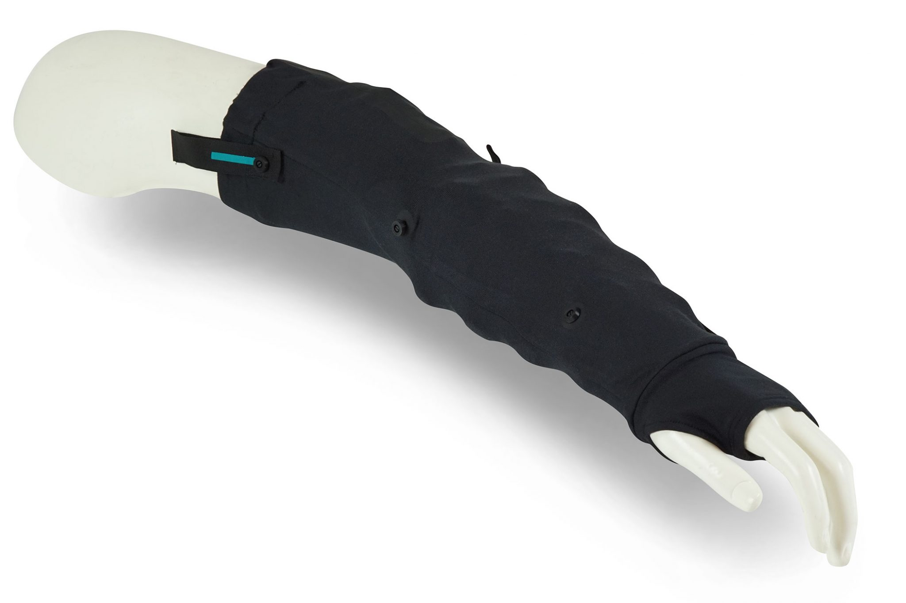
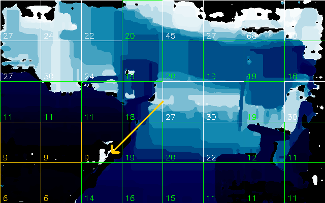
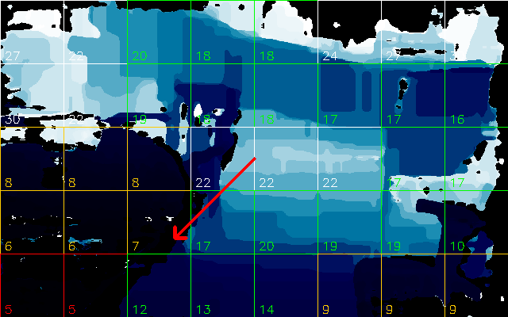
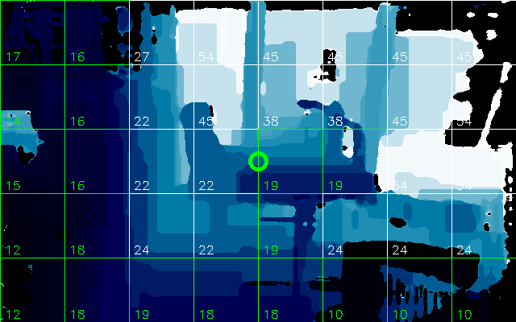
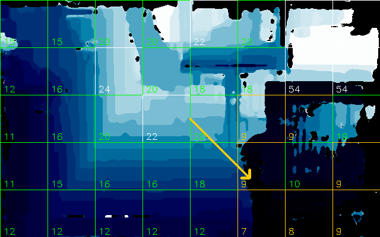

# Indoor Walking Assistant

Together with five other students from the Eindhoven University of Technology (TU/e), I created an assistive device for the visually impaired. Our prototype aims to provide haptic feedback in an understandable way, such that a visually impaired user is informed about obstacles in front of them.


## Contents

<ul>
  <li><a href="#technology">Technology</a></li>
  <li><a href="#screenshots">Screenshots</a></li>
  <li><a href="#prerequisites">Prerequisites</a></li>
  <li><a href="#run-locally">Run Locally</a></li>
  <li><a href="#settings">Settings</a></li>
  <li><a href="#keybinds">Keybinds</a></li>
  <li><a href="#future">Future</a></li>
</ul>


## Technology
The prototype consists of two devices, a <a href="#camera">stereo-depth camera</a> and a <a href="#sleeve">vibrating sleeve</a>. Both devices should be connected to a computer, which runs the software in this repository. 

### Camera
<br>
The input of the system is obtained using the <a href="https://docs.luxonis.com/projects/hardware/en/latest/pages/DM9095.html">OAK-D-Lite stereo depth camera</a>.

### Sleeve
<br>
The output of the system is provided using the <a href="https://elitacwearables.com/projects/case-study-haptic-feedback-sleeve/">Elitac haptic feedback sleeve</a>.

### Model
For a detailed explanation of the functionality of the model (as well as the development process) check out [the poster](/Resources/Poster.pdf).

In short, the camera makes a depth estimate for each pixel. These values are collected in cells using a grid. For each cell we use statistics to get a danger level. Lastly, we use more statistics to obtain the most significant area of the camera vision. The combination of this area and the maximum danger level of the view are used to create an output signal.


## Screenshots
Below are some screenshots of the software. These show visualizations of the model, in an indoor environment. The arrow in the screenshot is a visual representation of the output vibrations of the sleeve.

The arrow indicates the most significant area of the view, which defines the area where the sleeve vibrates. The color indicates the danger level, which also defines the intensity and frequency of the vibrations.

The arrow has 9 possible values, 3 horizontal and 3 vertical areas can be indicated by the arrow. The combination of horizontal and vertical center is shown using a circle in the center of the screen. If no arrow or circle is shown, it means that the system does not produce any output.

There are 3 colors for the arrow, green indicates a low danger level, orange indicates a medium danger level and red indicates a high danger level.

<details>
<summary>Example 1</summary>
This example shows a basic situation where multiple obstacles are in the camera view. The first screenshot shows that the most significant obstacle is in the bottom left region of the camera.<br>
<br>
This second screenshot is very similar to the previous screenshot, but it is taken one step closer to the objects to the left. This results in a higher danger level for this specific area, which results in a higher intensity output signal.<br>
<br>
</details>

<details>
<summary>Example 2</summary>
This example shows the visualization when there is no real obstacles in the view. It will indicate this using a green circle, indicating that there are some obstacles, but no real threats at this moment.<br>
<br>
This second screenshot is again very similar to the previous screenshot, but it is aimed a bit further downwards. This way it includes an obstacle that is considered dangerous, thus the user is notified of that.<br>
<br>
</details>


## Prerequisites

To run the software, multiple different prerequisites need to be setup. This section will discuss these prerequisites and provide some details on the installation. However, for more detailed installation and setup guides, check out the corresponding documentation linked for each prerequisite.

### Java
A modern version of Java is required to handle the requests for the sleeve. To install Java, follow the instructions on [this page](https://www.java.com/en/download/help/download_options.html).

### Python
A modern Python installation is required to run the depth model and send the requests to the sleeve. To install Python, download the installer on [this page](https://www.python.org/downloads/) and follow the instructions of the installer.  
Additionaly, we need some packages for the Python installation. These packages are listed below, including the installation instructions.

#### DepthAI
<details>
  <summary>Show Instructions</summary>

Using `pip install`

```bash
pip install depthai
```

Or following the [instructions](https://docs.luxonis.com/projects/api/en/latest/install/)
</details>

#### OpenCV
<details>
  <summary>Show Instructions</summary>

Using `pip install`

```bash
pip install opencv-python
```

Or following the [instructions](https://pypi.org/project/opencv-python/)
</details>

#### Numpy
<details>
  <summary>Show Instructions</summary>

Using `pip install`

```bash
pip install numpy
```

Or following the [instructions](https://numpy.org/install/)
</details>

#### Matplotlib
<details>
  <summary>Show Instructions</summary>

Using `pip install`

```bash
pip install matplotlib
```

Or following the [instructions](https://matplotlib.org/stable/users/installing/index.html)
</details>

#### Seaborn
<details>
  <summary>Show Instructions</summary>

Using `pip install`

```bash
pip install seaborn
```

Or following the [instructions](https://seaborn.pydata.org/installing.html)
</details>


## Run Locally

Clone the project

```bash
  git clone https://github.com/Rickerd1234/Autonomous-Walking-Group
```

Make sure you have correctly installed all <a href="#prerequisites">prerequisites</a>

Go to the project directory  
Optional: Run the sleeve software

```bash
  cd "Own Code/Sleeve"
  java -jar Elitac_HIDCOM_V2_1_0.jar
```

Go to the project directory  
Run "Own Code/Depth Model.py"

```bash
  python "Own Code/Depth Model.py"
```

This should start the depth model.  
(If you use the default settings, the visualization should appear)


## Settings

The depth model can be adjusted by changing the settings. This also contains settings for the visualization and some tools used for debugging. These settings can be found at the top of [`Depth Model.py`](/Own%20code/Depth%20Model.py).

| Setting   | Type     | Description                       |
| :-------- | :------- | :-------------------------------- |
| `USB_2_MODE`          | `Boolean` | DepthAI pipeline parameter, see [documentation](https://docs.luxonis.com/projects/api/en/latest/tutorials/hello_world/?highlight=usb2mode#initialize-the-depthai-device) for details |
| `LEFT_HANDED`         | `Boolean` | The sleeve is used on the left arm |
| `VISUALIZE_MODEL`     | `Boolean` | The model is visualized |
| `FULL_SCREEN_MODE`    | `Boolean` | The visualization is full screen |
| `SHOW_GRID`           | `Boolean` | The visualization is overlayed with the grid |
| `PLOT_DATA`           | `Boolean` | The data for each cell is plotted live |
| `CREATE_SNAPSHOT`     | `Boolean` | A snapshot of the data is stored (after at least 100 frames) |
| `SHOW_ARROW`          | `Boolean` | The 'output' arrow is shown on the visualization |
| `ARROW_LENGTH`        | `Integer` | The length of the 'output' arrow |
| `GRID_ROWS`           | `Integer` | The number of rows in the grid |
| `GRID_COLUMNS`        | `Integer` | The number of columns in the grid |
| `H_LEFT_GROUP`        | `Integer[]` | The indices of the columns that make up the left area of the grid |
| `H_CENTER_GROUP`      | `Integer[]` | The indices of the columns that make up the horizontal center area of the grid |
| `H_RIGHT_GROUP`       | `Integer[]` | The indices of the columns that make up the right area of the grid |
| `V_TOP_GROUP`         | `Integer[]` | The indices of the rows that make up the top area of the grid |
| `V_CENTER_GROUP`      | `Integer[]` | The indices of the rows that make up the vertical center area of the grid |
| `V_BOTTOM_GROUP`      | `Integer[]` | The indices of the rows that make up the bottom area of the grid |
| `BIN_SIZE`            | `Integer` | The size of the bins used to aggregate the depth data per cell |
| `SOFT_TRESHOLD`       | `Integer` | The treshold for the softest vibration output (maximum value to cause a vibration) |
| `MEDIUM_TRESHOLD`     | `Integer` | The treshold for the medium intensity vibration output |
| `INTENSE_TRESHOLD`    | `Integer` | The treshold for the maximum intensity vibration output |


## Keybinds

Besides the settings mentioned in the previous section, you can also use some keybinds to change the settings on the fly.

| Setting   | Affected Setting     | Description                       |
| :-------- | :------- | :-------------------------------- |
| `Q`       | `NONE` | Stop the model |
| `A`       | `SHOW_ARROW` | Toggle the 'output' arrow |
| `G`       | `SHOW_GRID` | Toggle the grid overlay |
| `S`       | `CREATE_SNAPSHOT` | Create a snapshot of the data (also freezes the frame for ~1 second) |
| `P`       | `NONE` | Create a screenshot of the window (also freezes the frame for ~1 second), this requires a folder named `/screenshots` in the current working directory |


## Future

The code in this repository was created within a relatively short timeframe. This leaves quite some room for improvement and further adaptation. In this section some of the possible additions are listed, as well as some flaws of the current system.

### Future Work
Some interesting things that could be explored in the future:
- The camera based model could be replaced by a 3D model, where it would provide feedback whether it is safe to step forward or not. (More about this in the last section of [the poster](/Resources/Poster.pdf))
- The settings and parameters of the model can be tweaked and improved. The current model has been tested, but this was not very excessive. Besides, the testing was done using 'blinding' glasses, whereas testing by the visually impaired would be more useful.
- Refactoring and cleaning of the code. Currently the main code consists of the [`SleeveHandler.py`](/Own%20code/SleeveHandler.py), which is concerned with controlling the sleeve, and [`Depth Model.py`](/Own%20code/Depth%20Model.py), which runs the model. Separating `Depth Model.py` into separate modules, could improve the code readability and reusability. For `SleeveHandler.py` it would be nice to have a more general vibration function, which makes it easier to use the sleeve in different projects.

### Current Flaws
Some flaws/downsides to the current model:
- The model uses a camera, thus depends heavily on the view of the camera. If the camera uses a bad angle, it will not be able to properly warn the user of obstacles.
- The model defines an obstacle as something that is close to the camera. Stairways or steps that go down, should still be classified as an obstacle, but are not included in this model.
- The treshold values are constants, they do not change based on the environment. Therefore, the device might work well in specific environments, but work very poorly in others.


## Other Files
The repository contains some more files that were used during development. These files are:

| File      | Description                       |
| :-------- | :-------------------------------- |
| [`SleeveTest.py`](/Own%20code/SleeveTest.py) | This script tries out all patterns in the [`/Sleeve/commands`](/Own%20code/Sleeve/commands) directory, with a interval between each individual command |
| [`First Demo.py`](/Own%20code/First%20Demo.py) | This is one of the first demo's used in the project. It requires to run in a different enviroment, read below for more details. |
| [`Second Version.py`](/Own%20code/Second%20Version.py) | This is the second version of the demo's used in the project. It requires to run in a different enviroment, read below for more details. |
| [`/Sleeve/`](/Own%20code/Sleeve) | This directory contains all the code and files required for hosting the sleeve. You can add custom patterns and commands in the respective directories. |

The environment required for `First Demo.py` and `Second Version.py` is the DepthAI repository. To run these scripts, add them to the repository locally and run them.<br>
If this is unclear, please follow the steps to run the [DepthAI demo script](https://docs.luxonis.com/en/latest/#demo-script). Instead of running `python3 depthai_demo.py`, you can add these scripts to the directory and run those instead.